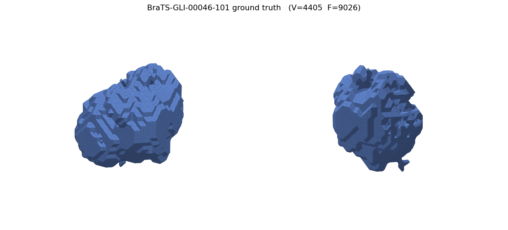
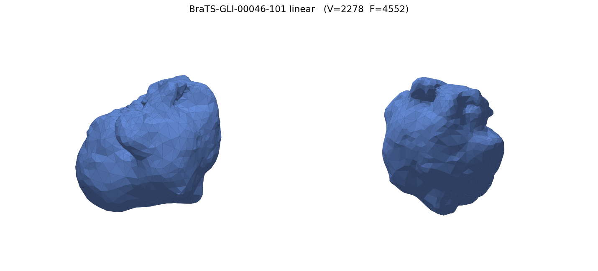

# Results — Tumor Contour Interpolation, 3D Reconstruction & Comparison

Real-data evaluation of the final-project pipeline on **BraTS 2024 GLI** (enhancing
tumor, label 3). Generated by `scripts/run_real_study.py` + `scripts/build_dashboard.py`.

## Pipeline (what was measured)

For each patient: trace the enhancing-tumor contour on every axial slice → **interpolate**
the in-between slices with three methods (**linear**, **spline**, **SDF**) → **Poisson**
reconstruct a closed 3D surface → compute metrics. Interpolation accuracy is measured by
**leave-one-slice-out (LOO)**: hide a real slice, predict it from its neighbours, and
compare to the held-out truth.

- **Cases evaluated (LOO):** 10 (those with the most ET slices among the first 40).
- **Held-out slices:** 420 per method (gap-corrected: `t` from the true slice heights;
  triplets with a z-gap > 3 skipped).
- **3D reconstruction + ground truth:** 3 representative cases.

## 1. Interpolation accuracy (leave-one-slice-out, 10 cases)

| method | Dice mean | **Dice median** | **% slices Dice > 0.8** | IoU mean | Hausdorff mean / median (mm) | area-err median |
|---|---|---|---|---|---|---|
| **linear** | 0.856 | **0.935** | **80.2 %** | 0.785 | 4.42 / 2.41 | 0.033 |
| **sdf**    | 0.843 | **0.937** | 78.3 %  | 0.774 | 4.74 / 2.38 | 0.030 |
| spline     | 0.821 | 0.912 | 71.7 %  | 0.742 | 4.93 / 2.70 | 0.048 |


**Reading the numbers**
- The **median Dice ≈ 0.93** means a *typical* held-out slice is reproduced with ~93 %
  region overlap — the interpolation is accurate where the tumor changes smoothly.
- The **mean is lower than the median** because a minority of hard slices (tiny tumor
  tips, or where the region splits/merges between slices) score near 0 and drag the
  average down. **Median and "% > 0.8" are the fairer headline numbers.**
- **Linear and SDF are essentially tied and best**; **spline is consistently weakest** —
  on real tumors the cross-section changes shape irregularly in z, so the spline's smooth
  through-plane fit overshoots, while the two-neighbour methods stay robust. (This is the
  *opposite* of the synthetic smooth-blob test, where spline won — a good sanity check
  that the metric is sensitive to real-world irregularity.)

## 2. 3D reconstruction vs. voxel ground truth

Mesh volume of each reconstruction vs. the segmentation's voxel volume (ratio ≈ 1 is ideal):

| case | linear (mm³) | spline (mm³) | sdf (mm³) | voxel GT (mm³) | ratio (linear) |
|---|---|---|---|---|---|
| BraTS-GLI-00046-101 | 37 513 | 38 479 | 36 557 | 25 306 | 1.48 |
| BraTS-GLI-00080-101 | 25 929 | 26 971 | 27 172 | 22 395 | 1.16 |
| BraTS-GLI-00469-100 | 41 971 | 43 706 | 41 929 | 34 911 | 1.20 |

All reconstructions are **closed and volume-bounding**. Volumes run slightly **above** the
voxel ground truth because the Poisson surface wraps the *outer* contour stack and fills
annular/necrotic cores that the voxel mask leaves hollow.

### Ground truth vs. reconstruction (case 00046-101)

| Ground truth (marching cubes of voxels) | Linear interpolation (Poisson) |
|---|---|
|  |  |

The reconstruction matches the overall tumor shape; the ground truth is blockier because it
is the raw voxel mask, while the reconstruction is a smooth interpolated surface.

## 3. Interactive dashboard

`scripts/build_dashboard.py` produces a single self-contained `dashboard.html` with, per
case, **rotatable 3D surfaces** for *ground truth · linear · spline · SDF* side by side,
plus the tables above. It is written to `data/results/dashboard.html` (that folder is
git-ignored, so the file is generated locally rather than committed).

## How to reproduce

```bash
# from src/final-project-interpolation, inside WSL (see RUN_LOCAL.md for setup)
BIN=~/builds/contour/contour_interpolator
python3 scripts/run_real_study.py \
        --dataset /path/to/BraTS2024-GLI/training_data1_v2 --bin "$BIN" \
        --extract 40 --topk 10 --n-vis 3
python3 scripts/build_dashboard.py --results data/results --out data/results/dashboard.html
# outputs: loo_aggregate.csv/png, loo_stats.csv, reconstruction_summary.csv,
#          mesh_<case>_<method>.off/.ply/.png, dashboard.html
```

## Limitations / notes

- **Label convention:** this dataset's early cases are ET-poor (post-treatment-like); the
  driver selects cases that actually contain enhancing tumor (ET = label 3).
- **Single contour per slice:** extraction keeps the largest contour, so multi-focal tumors
  are simplified — one reason a few LOO slices score low.
- **Reconstruction robustness:** sparse/irregular ring stacks once collapsed the Poisson
  mesh; this was fixed by falling back to the in-plane outward normal for points the
  normal-orientation step could not resolve.
- Numbers above are from 10 cases; rerun with a larger `--topk` for final-report statistics.
